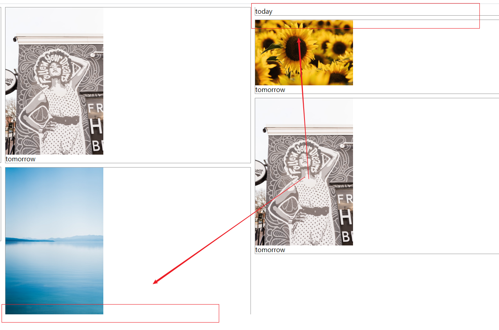
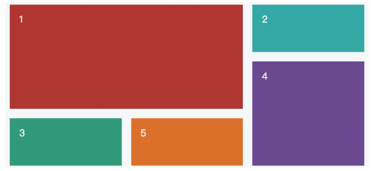

#### 如何实现一个瀑布流布局Masonry Layouts
##### 等宽型布局
###### CSS:Multi-column 
multi-column实现瀑布流主要依赖`column-count`和`column-width`都可以用来定义分栏的数目，而且并没有明确的优先级之分。优先级的计算取决与具体的场景。
计算方式为：计算`column-count`和`column-width`转换后具体的列数，哪个小就用哪个。

主要属性：
+ column-count: 设置共有几列
+ column-width: 设置每列宽度，列数由总宽度与每列宽度计算得出
+ column-gap: 设置列与列之间的间距
```javascript
     .masonry {
        column-count: 3;
        column-gap: 10px;
        column-width: 200px;
    }
    <div class="masonry">
        <div class="item">
           ...
        </div>
        <div class="item">
           ...
        </div>
    </div>
```

但我们单纯这样使用它发现我们的图片就这样断开了，这是我们不希望见到的，于是我们可以借助`break-inside:avoid`来避免，通过对行内元素规定不允许分行就实现了我们等宽瀑布流的想法。

###### Grid布局
通过将网页划分成一个个网格，任意组合不同的布局。

像上图这样的布局我们就是用Grid来轻松实现的。

主要属性：
+ display:设置为grid指明当前容器为Grid布局
+ grid-template-columns: 定义每一列的列宽 fr关键字
+ grid-template-rows: 定义每一行的行高
+ column-gap：用于设置列间距

```css
     .masonry {
            width: 1000px;
            display: grid;
            grid-template-rows: 1fr 1fr 1fr;
            /*分为3行*/
            grid-template-columns: 1fr 1fr 1fr;
            /*分为3列*/
            column-gap: 5px;
            /*列间距5px*/
        }

        <div class="masonry">
            <div class="item">
            ...
            </div>
            <div class="item">
            ...
            </div>
        </div>
```

###### flexbox布局
就是大名鼎鼎的`display:flex`布局
```css
    .masonry {
            display: flex;
            flex-direction: row;
            /*设置为水平方向*/
            width: 800px;
        }

   .column {
      display: flex;
      flex-direction: column;
            /*设置为竖直方向*/
      margin: 20px;
   }

   .masonry .column .item img {
      width: 100%;
   }

   <div class="masonry">
        <!-- 第一列 -->
        <div class="column">
            <div class="item">
              ..图片
            </div>
            <!-- more items-->
        </div>
        <!-- 第二列 -->
        <div class="column">
            <div class="item">
               ..图片
            </div>
            <!-- more items-->
        </div>
        <!-- 第三列 -->
        <div class="column">
            <div class="item">
                ..图片
            </div>
            <!-- more items-->
        </div>
    </div>

```
###### JS实现
​瀑布流本质上就是寻找各列之中高度最小的一列，并将新的元素添加到该列后面，只要有新的元素需要排列，就继续寻找所有列中的高度最小列，把后来的元素添加到高度最小列上。
[JS等宽瀑布流](./JS等宽瀑布流.html)

#### 等高瀑布流

//图片加载
 3 向下滚动自动刷新

 参考链接：
 [「中高级前端」干货！深度解析瀑布流布局](https://juejin.im/post/5ddb7a7c51882573520fb185#heading-6)
